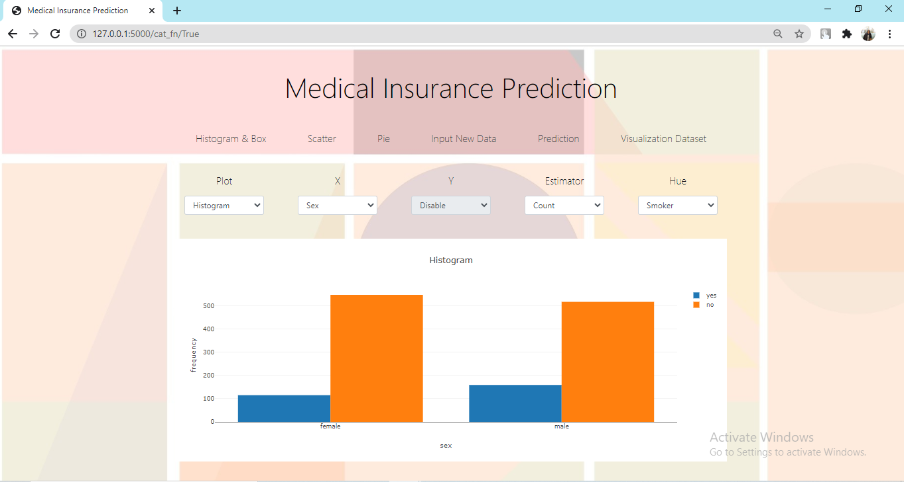

# Predict Medical Cost Personal
#### By : Fitri Damayanti

#

### Problem
- Asuransi kesehatan biayanya mahal
- Di Indonesia, adanya BPJS Kesehatan

### Background

Berikut ini beberapa pandangan yang keliru tentang asuransi kesehatan yang banyak beredar di masyarakat:
- Beli asuransi kesehatan sama saja buang-buang uang
- Percuma beli tapi klaim sulit
- Mencampuradukkan fungsi proteksi dan investasi
- Asuransi kesehatan biayanya mahal
- BPJS Kesehatan sudah memadai

Biaya premi pada setiap pasien berbeda-beda. Biaya tersebut tergantung pada banyak faktor, antara lain diagnosis penyakit, jenis/tempat perawatan, kota, usia, dan sebagainya.

**Sekedar informasi:**
- Makin tua umur nasabah maka preminya akan semakin mahal.
- Premi juga akan semakin mahal jika nasabah yang diasuransikan adalah seorang perokok.
- Ada perbedaan harga premi untuk nasabah laki-laki dan perempuan
- Sementara itu, orang yang memiliki kelebihan berat badan juga akan membayar premi lebih mahal daripada orang yang memiliki berat badan normal.

### Goals
Dapat memprediksi seberapa besar biaya asuransi kesehatan yang layak dibayar nasabah / pasien dalam satu tahun berdasarkan usia, gender,  BMI, banyak anak yang ditanggung, dan perokok atau tidak

#
## Dataset

Dataset yang digunakan berasal dari [kaggle](https://www.kaggle.com/mirichoi0218/insurance)

### Data Description
- Age : Umur Nasabah
- Sex : Jenis Kelamin Nasabah
- BMI : Indeks Massa Tubuh (kg / (m ** 2))
- Children : Jumlah Anak yang ditanggung asuransi
- Smoker : Nasabah Perokok
- Region : Daerah Pemukiman
- Charges : Biaya yang ditagih asuransi

### Data Exploration

#
## Exploratory Data Analysis

Semakin tua usia, semakin bertambah besar chargesnya, diperparah dengan faktor perokok

Bagi seorang perokok, BMI memengaruhi besar charges nasabah

Nasabah yang bukan perokok, tidak memengaruhi jumlah/banyak anak yang ia tanggung

Persebaran datanya menunjukkan jika nasabah berjenis kelamin laki-laki / male dan merokok / smoker memang memiliki charges yang lebih tinggi

### Feature Engineering
Dataset setelah dilakukan feature engineering

Dilakukan drop column 'region' dikarenakan di Indonesia tidak ada perbedaan besar charges untuk setiap daerah

### Data Description (After Feature Engineering)
- Age : Umur Nasabah
- Sex : Jenis Kelamin Nasabah (1 : Male, 0: Female)
- BMI : Indeks Massa Tubuh (kg / (m ** 2))
- Children : Jumlah Anak yang ditanggung asuransi
- Smoker : Nasabah Perokok (1: Yes, 0: No)
- Charges : Biaya yang ditagih asuransi

#
## Modelling Machine Learning

**Algoritma yang digunakan adalah:**
- LinearRegression
- ElasticNet
- RandomForestRegressor
- XGBoostRegressor

Berikut hasil evaluation metrics setiap algoritma:

**Data Description:**
- MAE_default : Mean Absolute Error dengan parameter default
- MAE_HPT : Mean Absolute Error yang telah di hyperparameter tuning
- MSE_default : Mean Square Error dengan parameter default
- MSE_HPT : Mean Square Error yang telah di hyperparameter tuning
- RMSE_default : Root Mean Square Error dengan parameter default
- RMSE_HPT : Root Mean Square Error yang telah di hyperparameter tuning
- R2_default : R Square dengan parameter default
- R2_HPT : R Square yang telah di hyperparameter tuning

#
## Dashboard

**Plot**

**SQL**

**Predict & Result**

**Visualization from Dataset**

#
